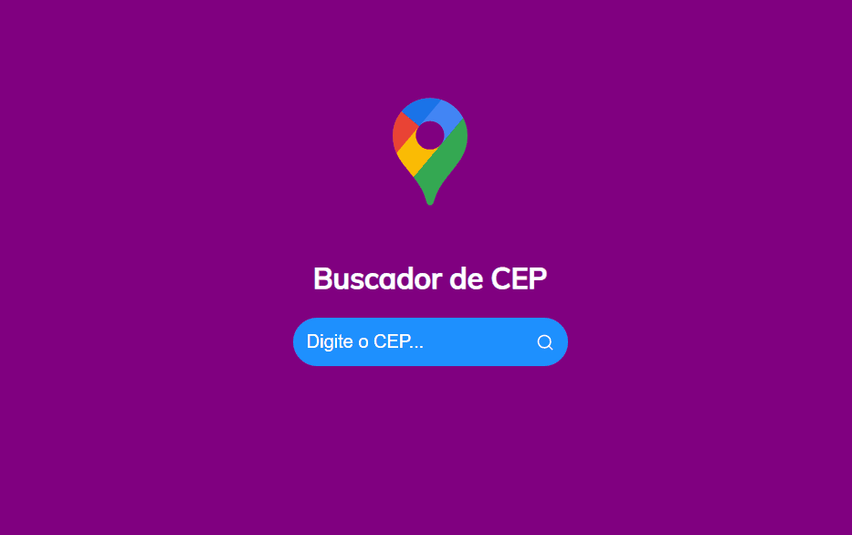

## 🧾 Descrição

O projeto é um buscador de CEP desenvolvido em React que utiliza uma API externa para buscar informações de endereço correspondentes ao CEP digitado pelo usuário. O código faz validações para campos vazios e exibe mensagens de erro quando necessário. 

<h1>

## 🔌 Tecnologias utilizadas

- **HTML:** linguagem de marcação usada para estruturar e apresentar o conteúdo da página;
- **JavaScript:** Linguagem de programação que permite criar interações dinâmicas na web. Com ela é possível manipular o conteúdo HTML e CSS em tempo real, validar formulários, criar animações, entre outras possibilidades.
- **React:** biblioteca JavaScript utilizada para construir interfaces de usuário.
- **Axios:** biblioteca JavaScript utilizada para fazer requisições HTTP para uma API externa.
- **Styled Components:** biblioteca JavaScript utilizada para escrever estilos CSS de forma mais dinâmica, utilizando JavaScript.
- **React Icons:** biblioteca de ícones para React.
- **Jest:** framework de testes utilizado para testar o código.
- **Testing Library:** biblioteca para testes de componentes React.
- **Web Vitals:** biblioteca utilizada para medir as métricas de desempenho do website.
- **Eslint:** ferramenta utilizada para análise estática de código, a fim de encontrar e corrigir problemas de estilo e boas práticas.

## ⚙️ Estrutura

- **img:** Contém imagens utilizadas no projeto e para apresentação no Readme.md;
- **public:** Contém a linguagem de marcação(index.html) usada para estruturar e apresentar o conteúdo da página e um arquivo (global.css) para estilização da página;
- **src:** Contém todo o código-fonte da aplicação, incluindo componentes, arquivos de estilização, imagens e outros recursos necessários.

## 🏳️ Como executar?

### **Passo 1**
Faça download do repositório

### **Passo 2**
Execute o comando ```npm install``` para instalar as dependências do projeto;

### **Passo 3**
Após a instalação das dependências, execute o comando ```npm start```;

### **Passo 4**
Aguarde o processo de compilação e será aberto no navegador no endereço http://localhost:3000.

<br>

## ✅ Resultado (Preview)

### **CEP**


<br>

## 💻 Autor: Luan Ferreira

Portfólio:
- [Github](https://github.com/fluanbrito)

Contato:
- [Linkedin](https://www.linkedin.com/in/luanferreirab/)

<h1>

## 🚀 Sobre mim
Sou um grande entusiasta e apaixonado por tecnologia, empreendedorismo e inovação. Hoje, estou a cursar o curso de Sistema de Informação pelo Instituto Federal, faço uso profissionalmente de ferramentas e me aprofundo em temas como Marketing, Machine Learning AWS, Metodologias ágeis, Gestão de Projetos, Programação Web, Administração de Sistemas, Redes de computadores, entre outros.
